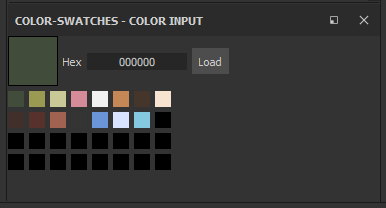

# Color Swatches

A quick way to load a color palette into SP for reference.

Unfortunately I haven't figured out how, if possible, to tap into the brush/paint properties yet. However, the uniform color's eye-dropper can be used to sample from the palette. No more color guessing!



Click the `Load` button to open JSON-based color palette.

**JSON file formats**

Option 1:
```
[
    "#0012AF",
    "#A296EB",
    "rgb(73, 201, 150)",
    ...
]
```

Option 2:
```
{
    "deep blue": "#0012AF",
    "violet": "#A296EB",
    "sea mint": "rgb(73, 201, 150)",
    ...
}
```
